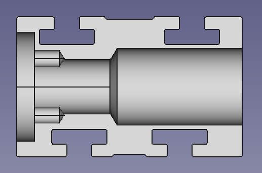
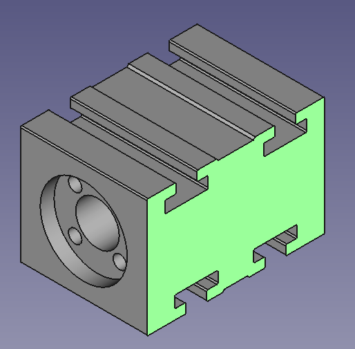

# T8 Nut Housings with T-Slots

## supported carriage types

Aluminium extrusion nut blocks for T8 lead screw nuts that can be bolted onto MGN12H, MGN15C and MGN15H carriages:

* MGN12H: 20 mm wide x 20 mm lengthwise M3 mounting pattern 
* MGN15C: 25 mm wide x 20 mm lengthwise M3 mounting pattern 
* MGN15H: 25 mm wide x 25 mm lengthwise M3 mounting pattern

Extrusion profile:

Please note: this design is currently a concept, dimensions are subject to change.

## design and adaption

To complete the block for a particiular carriage type, 

* 4x 3.3 mm (or 4.2 mm) diameter holes are drilled through the nut housing in the desired mounting pattern, matching the lengthwise spacing of the carriage. These will be access holes through which the screws will be tightened. Holes can be tapped for M4 (or M5) if the same mounting pattern is desired, otherwise the top side slots can be used for mounting.
* A T8 nut (brass or POM, with or without anti-backlash feature) is installed.
* 4x M3x8 ISO7380-2 V2A torx (T10) screws with washers or 4x M3x8 ISO 10642 (DIN 7991) V2A torx screws in countersunk slot nuts are inserted into the slots. 
* The nut housing it placed on top of an MGN12 or MGN15 carriage and the screws are driven step by step until finger tight.
* Parallelism of screw and rail are checked, and the placemnt of the end support or motor are optionally adjusted.
* Screws are torqued to 0.97 Nm (as per [table](https://www.anzugsmoment.de/metric-threads/metric-thread-bolt-torque-chart/)).

## comparison to other solutions

A [commercial housing](https://www.zonemaker.com/product/2670/aluminium-nut-t8-housing-%E0%B8%AA%E0%B8%B3%E0%B8%AB%E0%B8%A3%E0%B8%B1%E0%B8%9A-mgn12c-white) can be viewed [here](img/commercial_nut_housing.jpg). This unit shown is specific to one mounting pattern and foresees the top mounting screws to be inerted into aluminium. Using slot nuts, both the screw spacing and their diameters are free (M3 to M5 with variable spacing and offset).
